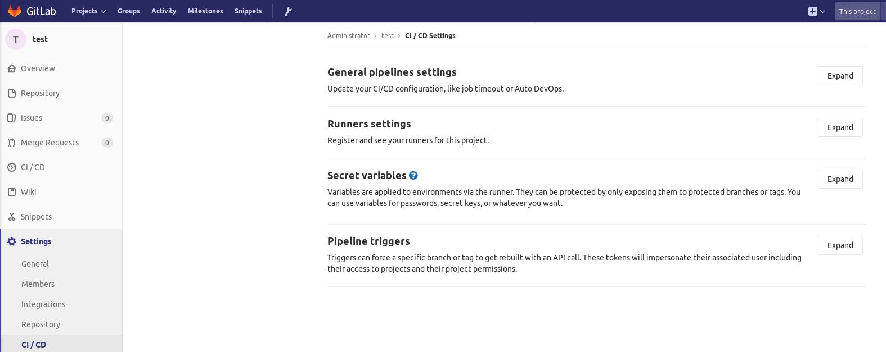
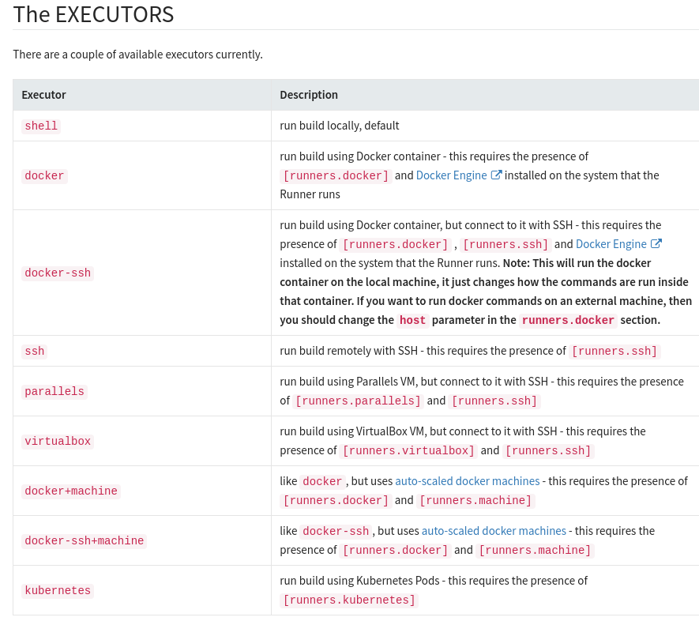

gitlab ci 使用

#### gitlab-ce与gitlab runner使用
   采用docker方式运行gitlab-ce，运行两个gitlab runner，一个运行在容器中，另一个安装在宿主机上。

#####运行gitlab-ce和gitlab runner容器
下载镜像
```
docker pull gitlab/gitlab-ce
docker pull gitlab/gitlab-runner
```
运行容器服务（/media/xww/sda1是我机器的一块盘）
```
docker run --detach \
    --hostname gitlab.example.com \
    --publish 8929:80 --publish 2289:22 \
    --name gitlab \
    --restart always \
    --volume /media/xww/sda1/myproject/gitlab-ce/gitlab/config:/etc/gitlab \
    --volume /media/xww/sda1/myproject/gitlab-ce/gitlab/logs:/var/log/gitlab \
    --volume /media/xww/sda1/myproject/gitlab-ce/gitlab/data:/var/opt/gitlab \
    gitlab/gitlab-ce:latest
```
运行gitlab-runner 容器服务
```
docker run -d --name gitlab-runner --restart always \
  -v /media/xww/sda1/myproject/gitlab-ce/gitlab-runner/config:/etc/gitlab-runner \
  -v /var/run/docker.sock:/var/run/docker.sock \
  gitlab/gitlab-runner:latest
```
编辑docker-compose.yml文件
```
gitlab-ce:
  image: 'gitlab/gitlab-ce:latest'
  restart: always
  hostname: 'gitlab.example.com'
  ports:
    - '8929:80'
    - '2289:22'
  volumes:
    - '/media/xww/sda1/myproject/gitlab-ce/gitlab/config:/etc/gitlab'
    - '/media/xww/sda1/myproject/gitlab-ce/gitlab/logs:/var/log/gitlab'
    - '/media/xww/sda1/myproject/gitlab-ce/gitlab/data:/var/opt/gitlab'
gitlab-runner:
  image: 'gitlab/gitlab-runner:latest'
  restart: always
  volumes:
    - '/var/run/docker.sock:/var/run/docker.sock'
    - '/media/xww/sda1/myproject/gitlab-runner/config:/etc/gitlab-runner'
```
#####ubuntu16.04 安装gitlab-runner
参考网址：https://mirror.tuna.tsinghua.edu.cn/help/gitlab-ci-multi-runner/
```
$ curl https://packages.gitlab.com/gpg.key 2> /dev/null | sudo apt-key add - &>/dev/null
$ cat > /etc/apt/sources.list.d/gitlab-ci-multi-runner.list <<EOF
>deb https://mirrors.tuna.tsinghua.edu.cn/gitlab-ci-multi-runner/ubuntu xenial main
>EOF
$ sudo apt-get update
$ sudo apt-get install gitlab-ci-multi-runner
```
#####为gitlab-ce配置gitlab-runner
进入gitlab上的项目中，在右侧setting>>CI/CD，进入配置页面，点击“Runners settings”旁边的“Expand”按钮。

在展开的页面上有配置Specific Runners的说明。
这里要注意网络的问题，保证gitlab-runner的服务可以访问gitlab-ce提供的url。

gitlab runner的类型有

这里我只使用了shell和docker类型。
使用
```
gitlab-ci-multi-runner register
```
按照提示配置gitlab-runer
我在gitlab-runner 容器中配置了docker 类型的runner（tag为docker）和shell类型的runner（tag为shell）（shell类型使用gitlab-runner安装所在环境变量，事实证明docker中的shell类型没什么用）。
在宿主机上gitlab-runner中配置了shell类型的runner（tag为host1）。

#####gitlab ci 使用实例
测试项目实例：https://github.com/sqshq/PiggyMetrics
下载项目后
在本机上运行docker registry容器服务192.168.122.1:5000
增添了两个文件
docker-compose.yml.template，.gitlab-ci.yml
docker-compose.yml.template文件内容如下
```
version: '2.1'
services:
  rabbitmq:
    image: 192.168.122.1:5000/rabbitmq:3-management
    restart: always
    ports:
      - 15672:15672
    logging:
      options:
        max-size: "10m"
        max-file: "10"

  config:
    environment:
      CONFIG_SERVICE_PASSWORD: $CONFIG_SERVICE_PASSWORD
    image: 192.168.122.1:5000/piggymetrics/config:REPLACE
    restart: always
    logging:
      options:
        max-size: "10m"
        max-file: "10"

  registry:
    environment:
      CONFIG_SERVICE_PASSWORD: $CONFIG_SERVICE_PASSWORD
    image: 192.168.122.1:5000/piggymetrics/registry:REPLACE
    restart: always
    depends_on:
      config:
        condition: service_healthy
    ports:
      - 8761:8761
    logging:
      options:
        max-size: "10m"
        max-file: "10"

  gateway:
    environment:
      CONFIG_SERVICE_PASSWORD: $CONFIG_SERVICE_PASSWORD
    image: 192.168.122.1:5000/piggymetrics/gateway:REPLACE
    restart: always
    depends_on:
      config:
        condition: service_healthy
    ports:
      - 80:4000
    logging:
      options:
        max-size: "10m"
        max-file: "10"

  auth-service:
    environment:
      CONFIG_SERVICE_PASSWORD: $CONFIG_SERVICE_PASSWORD
      NOTIFICATION_SERVICE_PASSWORD: $NOTIFICATION_SERVICE_PASSWORD
      STATISTICS_SERVICE_PASSWORD: $STATISTICS_SERVICE_PASSWORD
      ACCOUNT_SERVICE_PASSWORD: $ACCOUNT_SERVICE_PASSWORD
      MONGODB_PASSWORD: $MONGODB_PASSWORD
    image: 192.168.122.1:5000/piggymetrics/auth-service:REPLACE
    restart: always
    depends_on:
      config:
        condition: service_healthy
    logging:
      options:
        max-size: "10m"
        max-file: "10"

  auth-mongodb:
    environment:
      MONGODB_PASSWORD: $MONGODB_PASSWORD
    image: 192.168.122.1:5000/piggymetrics/mongodb:REPLACE
    restart: always
    logging:
      options:
        max-size: "10m"
        max-file: "10"

  account-service:
    environment:
      CONFIG_SERVICE_PASSWORD: $CONFIG_SERVICE_PASSWORD
      ACCOUNT_SERVICE_PASSWORD: $ACCOUNT_SERVICE_PASSWORD
      MONGODB_PASSWORD: $MONGODB_PASSWORD
    image: 192.168.122.1:5000/piggymetrics/account-service:REPLACE
    restart: always
    depends_on:
      config:
        condition: service_healthy
    logging:
      options:
        max-size: "10m"
        max-file: "10"

  account-mongodb:
    environment:
      INIT_DUMP: account-service-dump.js
      MONGODB_PASSWORD: $MONGODB_PASSWORD
    image: 192.168.122.1:5000/piggymetrics/mongodb:REPLACE
    restart: always
    logging:
      options:
        max-size: "10m"
        max-file: "10"

  statistics-service:
    environment:
      CONFIG_SERVICE_PASSWORD: $CONFIG_SERVICE_PASSWORD
      MONGODB_PASSWORD: $MONGODB_PASSWORD
      STATISTICS_SERVICE_PASSWORD: $STATISTICS_SERVICE_PASSWORD
    image: 192.168.122.1:5000/piggymetrics/statistics-service:REPLACE
    restart: always
    depends_on:
      config:
        condition: service_healthy
    logging:
      options:
        max-size: "10m"
        max-file: "10"

  statistics-mongodb:
    environment:
      MONGODB_PASSWORD: $MONGODB_PASSWORD
    image: 192.168.122.1:5000/piggymetrics/mongodb:REPLACE
    restart: always
    logging:
      options:
        max-size: "10m"
        max-file: "10"

  notification-service:
    environment:
      CONFIG_SERVICE_PASSWORD: $CONFIG_SERVICE_PASSWORD
      MONGODB_PASSWORD: $MONGODB_PASSWORD
      NOTIFICATION_SERVICE_PASSWORD: $NOTIFICATION_SERVICE_PASSWORD
    image: 192.168.122.1:5000/piggymetrics/notification-service:REPLACE
    restart: always
    depends_on:
      config:
        condition: service_healthy
    logging:
      options:
        max-size: "10m"
        max-file: "10"

  notification-mongodb:
    image: 192.168.122.1:5000/piggymetrics/mongodb:REPLACE
    restart: always
    environment:
      MONGODB_PASSWORD: $MONGODB_PASSWORD
    logging:
      options:
        max-size: "10m"
        max-file: "10"

  monitoring:
    environment:
      CONFIG_SERVICE_PASSWORD: $CONFIG_SERVICE_PASSWORD
    image: 192.168.122.1:5000/piggymetrics/monitoring:REPLACE
    restart: always
    depends_on:
      config:
        condition: service_healthy
    ports:
      - 9000:8080
      - 8989:8989
    logging:
      options:
        max-size: "10m"
        max-file: "10"
```
.gitlab-ci.yml文件内容如下
```
image: docker:latest
services:
  - docker:dind

variables:
  DOCKER_DRIVER: overlay
  SPRING_PROFILES_ACTIVE: gitlab-ci

#cache:
#  key: "$CI_BUILD_STAGE"
#  untracked: true

stages:
    - build
    - package
    - deploy

maven-build:
  tags:
    - docker
  image: 192.168.122.1:5000/mymaven:3.5-jdk8
  stage: build
  script: "mvn package -B -DskipTests"
  artifacts:
    paths:
      - config/target/*.jar
      - account-service/target/*.jar
      - monitoring/target/*.jar
      - registry/target/*.jar
      - auth-service/target/*.jar
      - gateway/target/*.jar
        #      - mongodb/target/*.jar
      - notification-service/target/*.jar
      - statistics-service/target/*.jar

docker-build:
  tags:
    - host1
  before_script:
    - docker login -u admin -p admin 192.168.122.1:5000  
  stage: package
  image: docker:latest
  script:
    - docker build -t 192.168.122.1:5000/piggymetrics/config:${CI_COMMIT_SHA:0:7} ./config
    - docker push 192.168.122.1:5000/piggymetrics/config:${CI_COMMIT_SHA:0:7}
    - docker build -t 192.168.122.1:5000/piggymetrics/account-service:${CI_COMMIT_SHA:0:7} ./account-service
    - docker push 192.168.122.1:5000/piggymetrics/account-service:${CI_COMMIT_SHA:0:7}
    - docker build -t 192.168.122.1:5000/piggymetrics/monitoring:${CI_COMMIT_SHA:0:7} ./monitoring
    - docker push 192.168.122.1:5000/piggymetrics/monitoring:${CI_COMMIT_SHA:0:7}
    - docker build -t 192.168.122.1:5000/piggymetrics/registry:${CI_COMMIT_SHA:0:7} ./registry
    - docker push 192.168.122.1:5000/piggymetrics/registry:${CI_COMMIT_SHA:0:7}
    - docker build -t 192.168.122.1:5000/piggymetrics/auth-service:${CI_COMMIT_SHA:0:7} ./auth-service
    - docker push 192.168.122.1:5000/piggymetrics/auth-service:${CI_COMMIT_SHA:0:7}
    - docker build -t 192.168.122.1:5000/piggymetrics/gateway:${CI_COMMIT_SHA:0:7} ./gateway
    - docker push 192.168.122.1:5000/piggymetrics/gateway:${CI_COMMIT_SHA:0:7}
    - docker build -t 192.168.122.1:5000/piggymetrics/mongodb:${CI_COMMIT_SHA:0:7} ./mongodb
    - docker push 192.168.122.1:5000/piggymetrics/mongodb:${CI_COMMIT_SHA:0:7}
    - docker build -t 192.168.122.1:5000/piggymetrics/notification-service:${CI_COMMIT_SHA:0:7} ./notification-service
    - docker push 192.168.122.1:5000/piggymetrics/notification-service:${CI_COMMIT_SHA:0:7}
    - docker build -t 192.168.122.1:5000/piggymetrics/statistics-service:${CI_COMMIT_SHA:0:7} ./statistics-service
    - docker push 192.168.122.1:5000/piggymetrics/statistics-service:${CI_COMMIT_SHA:0:7}

k8s-deploy:
  tags:
    - host1
  stage: deploy
  script:
    - docker-compose down
    - export CONFIG_SERVICE_PASSWORD="engine123"
    - export NOTIFICATION_SERVICE_PASSWORD="engine123"
    - export STATISTICS_SERVICE_PASSWORD="engine123"
    - export ACCOUNT_SERVICE_PASSWORD="engine123"
    - export MONGODB_PASSWORD="engine123"
    - printenv
    - cp docker-compose.yml.template docker-compose.yml
    - sed -i "s#REPLACE#${CI_COMMIT_SHA:0:7}#g" docker-compose.yml
    - docker-compose up -d
```
用gitlab-ce管理项目代码，每次代码提交都会出发gitlab ci依据.gitlab-ci.yml进行构建。