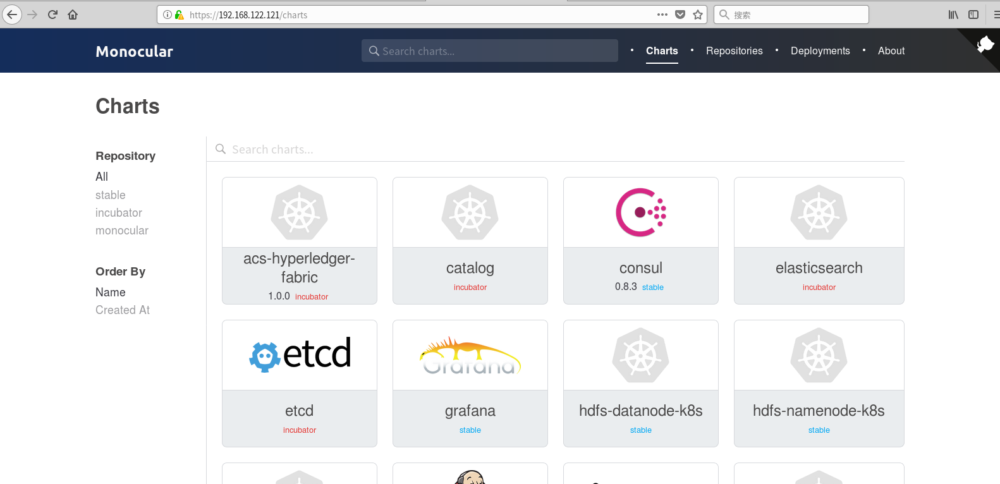

###Helm 基本概念
Helm 可以理解为 Kubernetes 的包管理工具，可以方便地发现、共享和使用为Kubernetes构建的应用，它包含几个基本概念

+ Chart：一个 Helm 包，其中包含了运行一个应用所需要的镜像、依赖和资源定义等，还可能包含 Kubernetes 集群中的服务定义，类似 Homebrew 中的 formula，APT 的 dpkg 或者 Yum 的 rpm 文件，
+ Release: 在 Kubernetes 集群上运行的 Chart 的一个实例。在同一个集群上，一个 Chart 可以安装很多次。每次安装都会创建一个新的 release。例如一个 MySQL Chart，如果想在服务器上运行两个数据库，就可以把这个 Chart 安装两次。每次安装都会生成自己的 Release，会有自己的 Release 名称。
+ Repository：用于发布和存储 Chart 的仓库。


###Helm 组件
Helm 采用客户端/服务器架构，有如下组件组成:
  Helm CLI 是 Helm 客户端，可以在本地执行；
  Tiller 是服务器端组件，在 Kubernetes 群集上运行，并管理 Kubernetes 应用程序的生命周期 ；
  Repository 是 Chart 仓库，Helm客户端通过HTTP协议来访问仓库中Chart的索引文件和压缩包。


###安装helm 客户端
参考 https://github.com/kubernetes/helm/blob/master/docs/install.md?spm=5176.100239.blogcont159601.25.ee1b35eCYPzhZ&file=install.md
下载安装helm
```
tar -zxvf helm-v2.8.0-rc.1-linux-amd64.tgz
mv linux-amd64/helm /usr/local/bin/helm
helm help
```
###安装helm服务端
因为网络原因，指定helm的repo为阿里云的https://kubernetes.oss-cn-hangzhou.aliyuncs.com/charts。
预先下载好了gcr.io/kubernetes-helm/tiller:v2.7.0镜像。
遇到错误failed to list: configmaps is forbidden: User "system:serviceaccount:kube-system:default" cannot list configmaps in the namespace "kube-system"
执行以下命令创建serviceaccount tiller并且给它集群管理权限，使用tiller的安装helm服务端。
```
kubectl create serviceaccount --namespace kube-system tiller
kubectl create clusterrolebinding tiller-cluster-rule --clusterrole=cluster-admin --serviceaccount=kube-system:tiller
kubectl patch deploy --namespace kube-system tiller-deploy -p '{"spec":{"template":{"spec":{"serviceAccount":"tiller"}}}}'
```
```
helm init --service-account tiller --upgrade -i gcr.io/kubernetes-helm/tiller:v2.7.0 --stable-repo-url https://kubernetes.oss-cn-hangzhou.aliyuncs.com/charts
```
###helm使用
若要查看在存储库中可用的所有 Helm charts，请键入以下命令：
```
helm search
```
若遇到Unable to get an update from the "stable" chart repository (https://kubernetes-charts.storage.googleapis.com) 错误
手动更换stable 存储库为阿里云的存储库
```
helm repo remove stable
helm repo add stable https://kubernetes.oss-cn-hangzhou.aliyuncs.com/charts
helm repo update
helm search
```
###卸载helm服务端
执行命令，加--force强制卸载
```
helm reset 或
helm reset --force
```
###安装chart 管理UI monocular
Monocular是一个开源软件，用于管理kubernetes上以Helm Charts形式创建的服务，可以通过它的web页面来安装helm Charts。
安装Nginx Ingress controller
安装的k8s集群启用了RBAC，则一定要加rbac.create=true参数。
```
helm install stable/nginx-ingress --set controller.hostNetwork=true，rbac.create=true
```
安装Monocular
```
$ helm repo add monocular https://kubernetes-helm.github.io/monocular
$ helm helm install monocular/monocular -f custom-repos.yaml
```
custom-repos.yaml为自己定义的chart repo源
```
cat ../../monocular/custom-repos.yaml
api:
  config:
    repos:
      - name: stable
        url: https://aliacs-app-catalog.oss-cn-hangzhou.aliyuncs.com/charts
        source: https://github.com/kubernetes/charts/tree/master/stable
      - name: incubator
        url: https://aliacs-app-catalog.oss-cn-hangzhou.aliyuncs.com/charts-incubator
        source: https://github.com/kubernetes/charts/tree/master/incubator
      - name: monocular
        url: https://kubernetes-helm.github.io/monocular
        source: https://github.com/kubernetes-helm/monocular/tree/master/charts
```
安装中遇到的问题是如和给monocular cahrt中mongodb的PVC持久化存储，这个就要依赖实践中kubernetes的环境了，我使用的k8s环境使用ceph rbd存储。我首先就要创建一个default storageclass给所以未明显指定storageclass的PVC使用，然后手动创建rbd image，创建k8s pv绑定到rbd image上。这样chart中pvc才会绑定到pv上，使用ceph存储。删除chart的release后，还要手动回收pv。此外，chart中镜像的下载也费劲。


目前的monocular只能使用chart的默认配置来部署chart的release，无法自定义配置值。