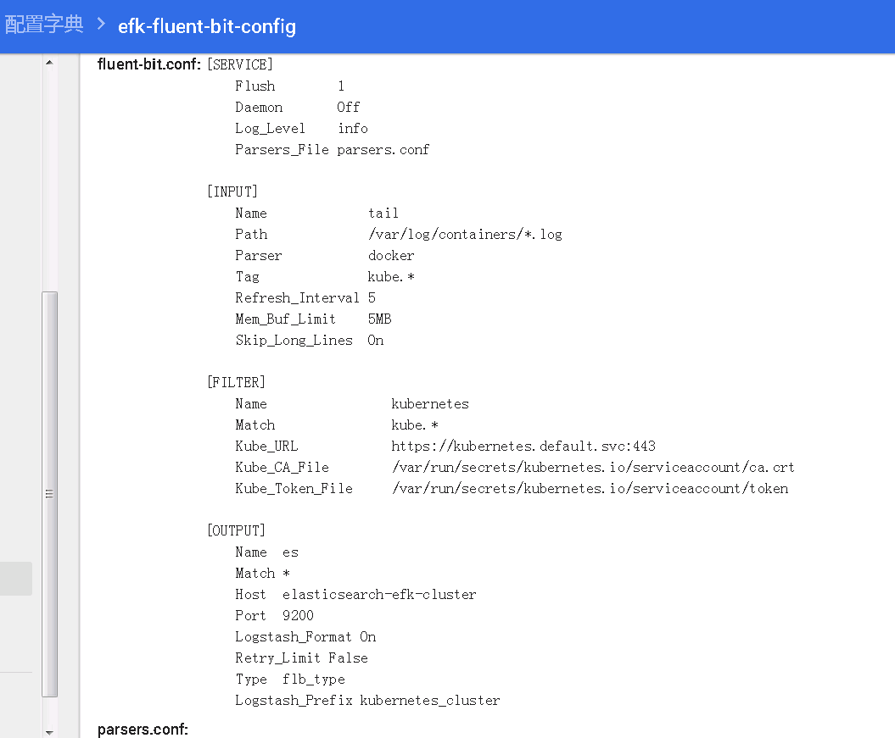
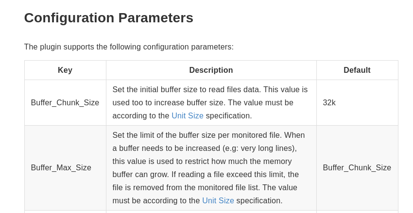

参考网址： https://fluentbit.io/documentation/current/configuration/file.html

fluent bit 配置文件支持4种类型section配置
* Service：定义service的全局属性配置。
* Input
* Filter
* Output

此外，还可以在include中指定外部文件。
###fluent-bit配置
在service区域下的Flush可以配置fluent-bit的出刷新周期。
实验环境的fluent-bit配置如下：

可以看到服务的输出刷新周期为1s。日志级别设置为info。
在service区域还可以配置fluent-bit为Daemon运行，监听指定IP和端口（HTTP_*），其他程序服务主动把日志推送到指定的IP和端口。


input区域的配置使用了tail插件
它配置监控目录```/var/log/containers/*.log```刷新周期为5秒，使用的内存限制为5MB，单行最大长度使用默认配置

最大行长度为32k，超过最大行长度将会skip（配置Skip_Long_Lines On）。

filter区域使用了kubernetes插件
fluent-bit以daemonset形式部署在kubernetes环境，使用kubernetes filter插件旨在以下两个作用
1,分析带tag（实验中为Match: kube.*）的记录，抽取元数据信息
2,查询kubernetes api server获取pod的元数据信息

配置的解析信息如下


output区域使用了elasticsearch插件
Host与Port指定了目标elasticsearch。

Logstash_Format与Logstash_Prefix指定创建index的名字
