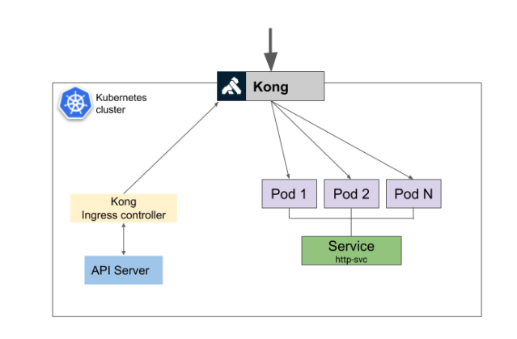

###部署k8s-kong-ingresscontroller
k8s-kong-ingresscontroller的组件在k8s中的通信图如下

实验环境在配置了使用k8s-nfs-provisioner插件存储的kubernetes环境，nfs存储插件k8s-nfs-provisioner配置这里不做介绍，参考另一篇文章。
首先，配置nfs的storageclass为default storageclasse。
```
kubectl patch storageclass <your-class-name> -p '{"metadata": {"annotations":{"storageclass.kubernetes.io/is-default-class":"true"}}}'
```
下载kubernetes-ingress-controller的yaml文件。
```
wget https://raw.githubusercontent.com/Kong/kubernetes-ingress-controller/master/deploy/single/all-in-one-postgres.yaml
```
可以看到all-in-one-postgres.yaml文件中postgres数据库使用了默认的storageclasse来创建持久化存储。
```
...
...
...
volumes:
      - name: datadir
        persistentVolumeClaim:
          claimName: datadir
  volumeClaimTemplates:
  - metadata:
      name: datadir
    spec:
      accessModes:
        - "ReadWriteOnce"
      resources:
        requests:
          storage: 1Gi
...
...
...
```
执行以下命令部署kubernetes-ingress-controller。
```
kubectl create -f all-in-one-postgres.yaml
```
运行用例服务来演示实现url转发，认证，请求速率限制等功能。
```
curl https://raw.githubusercontent.com/Kong/kubernetes-ingress-controller/master/deploy/manifests/dummy-application.yaml \
  | kubectl create -f -
```
###k8s-kong-ingresscontroller配置http 头部转发
在实验环境里，kong-ingresscontroller可以通过ingress来配置kong管理面板创建router实现http 头部转发功能。
dummy-ingress.yaml文件内容如下
```
apiVersion: extensions/v1beta1
kind: Ingress
metadata:
  name: foo-bar
spec:
  rules:
  - host: foo.bar
    http:
      paths:
      - path: /
        backend:
          serviceName: http-svc
          servicePort: 80
```
创建ingress后，使用
```
http ${PROXY_IP}:${HTTP_PORT} Host:foo.bar
```
可以访问dummy示例的服务。
配置tls认证
生成tls证书
```
openssl req -x509 -nodes -days 365 -newkey rsa:2048 -keyout tls.key -out tls.crt -subj "/CN=secure-foo-bar/O=konghq.org"
```
证书数据存入secret
```
kubectl create secret tls tls-secret --key tls.key --cert tls.crt
```
dummy-ingress2.yaml文件内容如下
```
apiVersion: extensions/v1beta1
kind: Ingress
metadata:
  name: secure-foo-bar
spec:
  tls:
  - hosts:
    - secure.foo.bar
    secretName: tls-secret
  rules:
  - host: secure.foo.bar
    http:
      paths:
      - path: /
        backend:
          serviceName: http-svc
          servicePort: 80
```
创建ingress后，使用
```
curl -v -k --resolve secure.foo.bar:${HTTPS_PORT}:${PROXY_IP} https://secure.foo.bar:${HTTPS_PORT}
```
可以访问dummy示例的服务。
###k8s-kong-ingresscontroller配置http 子url转发

参考网址： https://github.com/Kong/kubernetes-ingress-controller/issues/44

kong的ingresscontroller默认忽略没有定义host的ingress。所以在配置http 子url转发时需要连同host一起配置。
文件```dummyurl-ingress.yaml```创建的ingress如下
```
apiVersion: extensions/v1beta1
kind: Ingress
metadata:
  name: foo-bar
#  annotations:
#    kubernetes.io/ingress.class: "kong"
spec:
  rules:
  - host: foo.bar
    http:
      paths:
      - path: /testpath
        backend:
          serviceName: http-svc
          servicePort: 80
```
使用命令
```
curl -v  http://${PROXY_IP}:${HTTPS_PORT}/testpath --header 'Host: foo.bar'
```
可以访问dummy示例的服务。
###k8s-kong-ingresscontroller配置api key认证
###k8s-kong-ingresscontroller配置jwt认证

参考网址： https://github.com/Kong/kubernetes-ingress-controller/blob/master/docs/examples/externalnamejwt.md

###k8s-kong-ingresscontroller配置请求次数限制
创建速率限制的kongplugin，它的yaml文件内容如下，它基于client ip作访问次数的限制，限制为每1小时内100次请求。
```
apiVersion: configuration.konghq.com/v1
kind: KongPlugin
metadata:
  name: add-ratelimiting-to-route
config:
  hour: 100
  limit_by: ip
  second: 10
```
可以通过annotations把kongplugin应用到Kubernetes Services或者Ingress（Services的annotations优先级比Ingress的annotations高）
使用以下命令把kongplugin应用到Kubernetes Services
```
kubectl patch ingress foo-bar \
  -p '{"metadata":{"annotations":{"rate-limiting.plugin.konghq.com":"add-ratelimiting-to-route\n"}}}'
```
使用以下命令把kongplugin应用到Kubernetes Ingress
```
kubectl patch svc http-svc \
  -p '{"metadata":{"annotations":{"rate-limiting.plugin.konghq.com": "add-ratelimiting-to-route\n"}}}'
```
应用后可以通过命令查看kong的plugin的产生
```
http ${KONG_ADMIN_IP}:${KONG_ADMIN_PORT}/plugins
```
###k8s-kong-ingresscontroller配置请求块大小限制