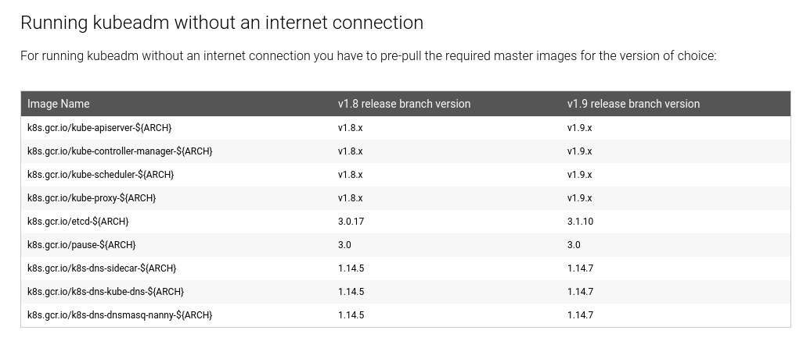

参考网址：https://kubernetes.io/docs/setup/independent/install-kubeadm/
https://kubernetes.io/docs/setup/independent/create-cluster-kubeadm/
###安装docker
centos7安装docker二进制包
到https://download.docker.com/linux/centos/7/x86_64/stable/Packages/下载docker rpm包
我下载了docker-ce-17.03.2.ce-1.el7.centos.x86_64.rpm 和 docker-ce-selinux-17.03.2.ce-1.el7.centos.noarch.rpm
执行命令
```
yum localinstall docker-ce-selinux-17.03.2.ce-1.el7.centos.noarch.rpm docker-ce-17.03.2.ce-1.el7.centos.x86_64.rpm
```
###安装kubeadm
1、安装cni插件
```
CNI_VERSION="v0.6.0"
mkdir -p /opt/cni/bin
curl -L "https://github.com/containernetworking/plugins/releases/download/${CNI_VERSION}/cni-plugins-amd64-${CNI_VERSION}.tgz" | tar -C /opt/cni/bin -xz
```
2、安装kubeadm kubelet kubectl
```
RELEASE="$(curl -sSL https://dl.k8s.io/release/stable.txt)"

mkdir -p /opt/bin
cd /opt/bin
curl -L --remote-name-all https://storage.googleapis.com/kubernetes-release/release/${RELEASE}/bin/linux/amd64/{kubeadm,kubelet,kubectl}
chmod +x {kubeadm,kubelet,kubectl}

curl -sSL "https://raw.githubusercontent.com/kubernetes/kubernetes/${RELEASE}/build/debs/kubelet.service" | sed "s:/usr/bin:/opt/bin:g" > /etc/systemd/system/kubelet.service
mkdir -p /etc/systemd/system/kubelet.service.d
curl -sSL "https://raw.githubusercontent.com/kubernetes/kubernetes/${RELEASE}/build/debs/10-kubeadm.conf" | sed "s:/usr/bin:/opt/bin:g" > /etc/systemd/system/kubelet.service.d/10-kubeadm.conf
```
设置开机启动并启动kubelet
```
systemctl enable kubelet && systemctl start kubelet
```
###kubeadm安装k8s
下载k8s的docker 镜像
k8s1.9.x版本所需的docker镜像在https://kubernetes.io/docs/reference/setup-tools/kubeadm/kubeadm-init/ 有说明。

```
#!/bin/bash

set -x
dockerimages=(k8s.gcr.io/kube-apiserver-amd64:v1.9.1
k8s.gcr.io/kube-controller-manager-amd64:v1.9.1
k8s.gcr.io/kube-scheduler-amd64:v1.9.1
k8s.gcr.io/kube-proxy-amd64:v1.9.1
k8s.gcr.io/etcd-amd64:3.1.10
k8s.gcr.io/pause-amd64:3.0
k8s.gcr.io/k8s-dns-sidecar-amd64:1.14.7
k8s.gcr.io/k8s-dns-kube-dns-amd64:1.14.7
k8s.gcr.io/k8s-dns-dnsmasq-nanny-amd64:1.14.7)

j=1
for i in ${dockerimages[@]}
do
    echo $i
    echo $j

    docker pull $i && docker save $i | xz $j.tar.xz
    docker rmi $i
    let j+=1
done
set +x


```
1、初始化master
配置主机的192.168.122.120为apiserver监听的地址，设置pod的网段为10.244.0.0/16
```
kubeadm init --apiserver-advertise-address=192.168.122.120  --pod-network-cidr=10.244.0.0/16 --kubernetes-version=v1.9.1 --ignore-preflight-errors=Swap
```
2、配置非root用户使用kubectl命令
```
mkdir -p $HOME/.kube
sudo cp -i /etc/kubernetes/admin.conf $HOME/.kube/config
sudo chown $(id -u):$(id -g) $HOME/.kube/config
```
root用户使用kubectl命令
```
export KUBECONFIG=/etc/kubernetes/admin.conf
```
3、安装pod网络
这里我使用canal网络插件
```
kubectl apply -f https://raw.githubusercontent.com/projectcalico/canal/master/k8s-install/1.7/rbac.yaml
kubectl apply -f https://raw.githubusercontent.com/projectcalico/canal/master/k8s-install/1.7/canal.yaml
```
4、配置master可以调度并运行pod
```
kubectl taint nodes --all node-role.kubernetes.io/master-
```
5、加入节点
登录需要加入的节点机器上，以root运行kubeadm init运行后提示的命令
```
kubeadm join --token <token> <master-ip>:<master-port> --discovery-token-ca-cert-hash sha256:<hash>
```
###kubeadm重置k8s
首先把所有k8s节点设为维护状态
```
kubectl drain <node name> --delete-local-data --force --ignore-daemonsets
kubectl delete node <node name>
```
执行reset命令
```
kubeadm reset
ifconfig cni0 down
ip link delete cni0
ifconfig flannel.1 down
ip link delete flannel.1
rm -rf /var/lib/cni/
```
###遇到的问题
遇到问题首先查看kubelet程序
```
systemctl status kubelet
journalctl -xeu kubelet
```
错误提示1
```
kubelet cgroup driver: "cgroupfs" is different from docker cgroup driver: "systemd"
```
编辑kubelet的配置文件/etc/systemd/system/kubelet.service.d/10-kubeadm.conf
把--cgroup-driver=cgroupfs替换为--cgroup-driver=systemd
错误提示2
```
error: failed to run Kubelet: Running with swap on is not supported, please disable swap! or set --fail-swap-on flag to false
```
编辑kubelet的配置文件/etc/systemd/system/kubelet.service.d/10-kubeadm.conf
在--cgroup-driver=systemd加上配置变为--cgroup-driver=systemd --fail-swap-on=false