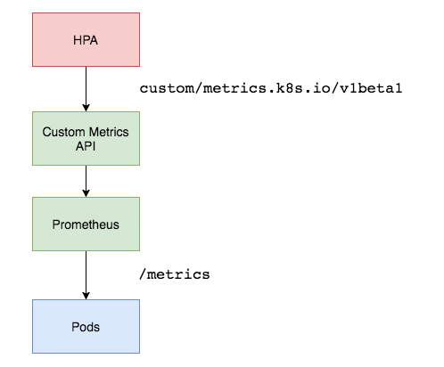

###kubernetes对自定义指标进行动态伸缩

参考网址：https://github.com/stefanprodan/k8s-prom-hpa

###常规cpu 内存指标收集
kubernetes Metrics server，它是 Heapster的可替代者。


参考github上基本上就可以部署出
注意点：
1、kube-apiserver需要配置参数接受第三方插件MetricsServer的访问，参数配置如下
```
--enable-aggregator-routing=true
--requestheader-client-ca-file=/etc/kubernetes/ssl/ca.pem
--requestheader-extra-headers-prefix=X-Remote-Extra-
--requestheader-group-headers=X-Remote-Group
--requestheader-username-headers=X-Remote-User
--proxy-client-cert-file=/etc/kubernetes/ssl/kubernetes.pem
--proxy-client-key-file=/etc/kubernetes/ssl/kubernetes-key.pem
```
暂时不要配置参数
```
--requestheader-allowed-names=metrics-server
```
运行的过程中有问题，暂不知道原因。
2、注意点1中的的ca.pem，kubernetes.pem，kubernetes-key.pem产生过程如下
原因和原理请参考
https://github.com/kubernetes-incubator/apiserver-builder/blob/master/docs/concepts/auth.md#serving-certificates
https://kubernetes.io/docs/admin/authentication/#authenticating-proxy
https://jimmysong.io/posts/kubernetes-tls-certificate/

1）生成requestheader-client-ca.crt和requestheader-client-ca.key
```
openssl req -x509 -sha256 -new -nodes -days 365 -newkey rsa:2048 -keyout requestheader-client-ca.key -out requestheader-client-ca.crt -subj "/CN=aggregator"
```
2）生成requestheader-client-ca-config.json
```
echo '{"signing":{"default":{"expiry":"43800h","usages":["signing","key encipherment","'requestheader-client'"]}}}' > "requestheader-client-ca-config.json"
```
注意这里的requestheader-client位置
3）生成metrics-server-csr.json文件
```
export SERVICE_NAME=metrics-server
export ALT_NAMES='"metrics-server.kube-system","metrics-server.kube-system.svc"'
echo '{"CN":"'${SERVICE_NAME}'","hosts":['${ALT_NAMES}'],"key":{"algo":"rsa","size":2048}}' >  metrics-server-csr.json
```
4）生成文件aggregator.csr，aggregator.pem，aggregator-key.pem文件
```
cfssl gencert -ca=requestheader-client-ca.crt -ca-key=requestheader-client-ca.key -config=requestheader-client-ca-config.json metrics-server-csr.json | cfssljson -bare aggregator
```
至此,重命名文件
```
mv requestheader-client-ca.crt ca.pem
mv aggregator.pem kubernetes.pem
mv aggregator-key.pem kubernetes-key.pem
```
把文件放到/etc/kubernetes/ssl文件夹中，就可以被kube-apiserver使用了。

###自定义指标收集

收集自定义指标需要两个组件，收集和存储自定义指标的时序数据库 Prometheus、提供custom metrics API的组件Custom Metrics Server。



参考github上基本上就可以部署出

###监控
这里Prometheus时序数据库存储性能数据，需要搭建grafana来展示性能数据。此外，还需定制的grafana dashboard来更好的展示性能数据
https://github.com/giantswarm/kubernetes-prometheus
项目中，有grafana的yaml文件，可以部署grafana到kubernetes中，并且按照说明可以配置集成Prometheus。
定制的dashboard
https://grafana.com/dashboards/737
此外，另外两个grafana dashboard也展示的非常好
https://grafana.com/dashboards/1471
https://grafana.com/dashboards/1621
