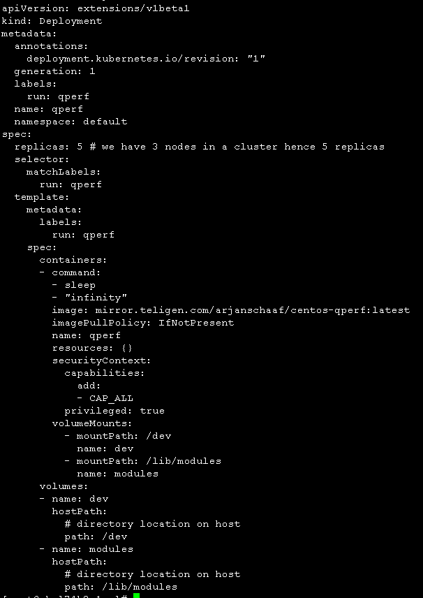
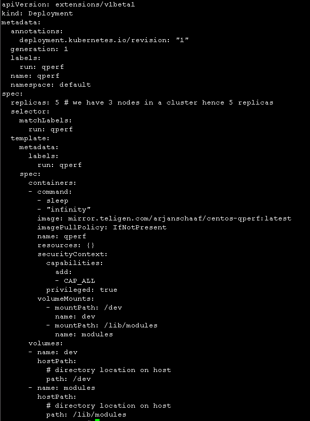

###kubernetes集成calico测试环境
在物理服务器使用KVM构建了三台虚拟机（4core8G），服务器上的网卡是万兆，虚拟机与虚拟机之间使用KVM的NAT网络模式。
三个节点充当kubernetes的master和worker角色，kubernetes拥有三个master和三个worker。
###kubernetes集成calico测试场景
  目前部署的kubernetes可以集成calico1.0和calico3.0网络。此外，calico网络模式还可以选择是否配置IP-IN-IP封装，不配置IP-IN-IP封装能提高跨主机容器之间的网络传输速率，但是主机节点不能访问另一台主机节点上的容器（具体见测试结果）。
  下面对测试场景进入如下划分：
  1、kubernetes集成calico1.0,并且配置IP-IN-IP封装网络模式。
  2、kubernetes集成calico1.0,并且不配置IP-IN-IP封装网络模式。
  3、kubernetes集成calico3.0,并且配置IP-IN-IP封装网络模式。
  4、kubernetes集成calico3.0,并且不配置IP-IN-IP封装网络模式。
每个测试场景都是3个节点的kubernetes集群（每个节点既是master又是worker）
针对每个测试场景，选择iperf和qperf进行如下5中测试（pod是kubernetes中的概念，可以类比为容器）
1）NODE TO REMOTE NODE：节点到另一个节点之间的网络性能
2）NODE TO REMOTE POD：节点到另一个节点上pod的网络性能
3）POD TO REMOTE POD：pod到另一个节点上pod的网络性能
4）POD TO REMOETE NODE：pod到另一个节点的网络性能
5）POD TO POD LOCAL：pod到同一个节点上pod的网络性能
6）NODE TO NODE LOCAL：节点到同一个节点的网络性能
###iperf和qperf工具使用
####宿主机节点使用iperf和qperf
iperf服务端
```
iperf3 -s
```
iperf客户端
```
iperf3 -c $serverIP
```
实际测试时用脚本测试20次后，取平均值。


qperf服务端
```
qperf -lp 4000
```
qperf客户端
```
qperf $serverIP -lp 4000 -ip 4001  -t 100 tcp_bw tcp_lat
```
tcp_bw tcp_lat 指定测试传输速率和传输时延，可以替换为其他qperf参数
-t 100指定测试时间为100秒
####kubernetes pod中使用iperf和qperf
iperf用于生成测试pod的yaml文件为

qperf用于生成测试pod的yaml文件为

###测试结果
结果数据如下：

结论：
1,calico禁用IP-IN-IP封装模式可以大幅提升不同节点间容器的通信网络传输速率，但是一个节点不能访问另一个节点的容器。
2,calico3.0和calico1.0网络插件的网络传输速率相差不大，calico3.0略微优于calico1.0。此外calico3.0还支持kubernetes的hostport参数配置主机网路模式（calico1.0不支持）。