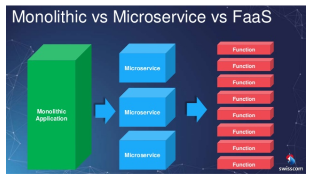

###什么是serverless
跟很多其它软件类似，对Serverless还没有清晰定义，但是肯定有两个互相有重叠的定义：
* BaaS: Serverless最初是用于描述依赖第三方服务（‘云端’）实现对逻辑和状态进行管理的应用。典型的包括“厚客户端”（例如单页Web应用、移动应用），他们一般都使用基于云端的数据库（例如Parse、Firebase），认证服务（Auth0、AWS congnito）等。这类服务以前被称为”（Mobile） backend as a Service ”，我将在本文中称他们为“BaaS”。
* FaaS: Serverless也可以指这样的应用，一部分服务逻辑由应用实现，但是跟传统架构不同在于，他们运行于无状态的容器中，可以由事件触发，短暂的，完全被第三方管理。（感谢ThoughtWorks在最近Tech Radar中做出的定义）。这种思路是‘Functions as a Service / FaaS’，AWS Lambda是目前最佳的FaaS实现之一，本文后续介绍中将使用FaaS作为这种架构的缩写。

但是我更愿意讨论的是本领域第二种方式，相比来说技术架构更新，引领了Serverless的很多创新。
####与PaaS比较
```
如果你的PaaS可以将以前半秒启动的应用在20ms内启动，就叫它Serverless。——Adrian Cockcroft
```
换句话说，许多PaaS应用不会每次请求来了启动，请求结束则关闭。而FaaS平台是这样的。


serverless的粒度比微服务的粒度更细。

###serverless开源工具

IBM的OpenWhisk，现已为apache的孵化项目。

基于kubernetes的serverless开源工具
kubeless
fission